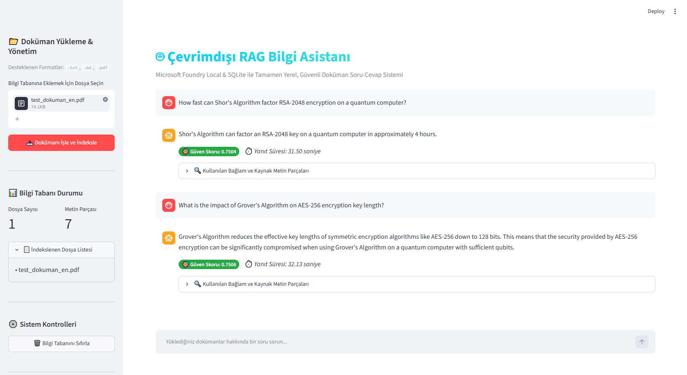
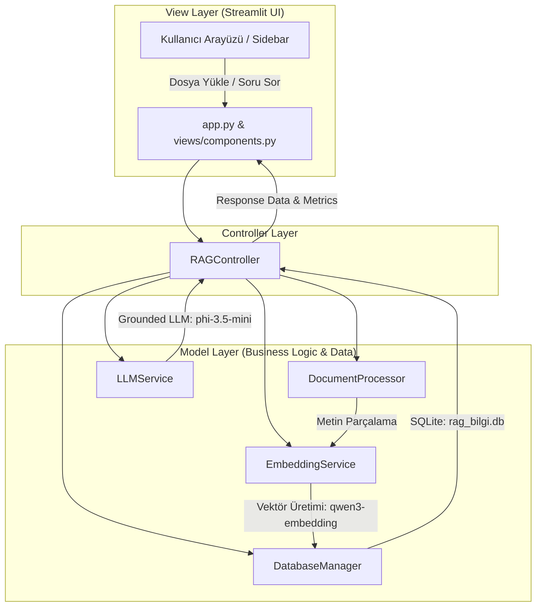

# 🤖 Yerel RAG Bilgi Asistanı

[](https://www.python.org/)
[]()
[](https://github.com/)
[](https://streamlit.io/)
[]()

**Yerel RAG Bilgi Asistanı**, `.txt`, `.md` ve `.pdf` formatındaki dokümanların tamamen **çevrimdışı (offline)** ve güvenli bir şekilde sorgulanabilmesini sağlayan, **MVC** mimarisinde geliştirilmiş uçtan uca bir yapay zekâ uygulamasıdır.

Bulut tabanlı API'lere veya internet bağlantısına ihtiyaç duymadan, **Microsoft Foundry Local SDK** ile cihaz üzerinde (CPU/NPU) yerel olarak çalışır.

---

## 🖼️ Ekran Görüntüsü



---

## 🌟 Öne Çıkan Özellikler

- 🔒 **%100 Çevrimdışı ve Güvenli:** Hiçbir veri cihaz dışına çıkmaz. Kurumsal belgeler için tam veri gizliliği sağlar.
- 📁 **Dinamik Doküman Yükleme:** Sürükle-bırak arayüzü ile `.txt`, `.md` ve `.pdf` dosyalarını yükleme, anında parçalama ve indeksleme.
- 🏗️ **Modüler Mimari:** Sürdürülebilir ve modüler katmanlı yapı (`models/`, `controllers/`, `views/`).
- ⚡ **Vektör Veri Tabanı ve Anlamsal Arama:** SQLite tabanlı veri katmanı ve Kosinüs Benzerliği ile vektör araması.
- 🛡️ **Güvenlik Eşiği (Guardrails):** Belirlenen benzerlik eşiğinin (`0.30`) altındaki sorgularda halüsinasyon riskini engellemek için LLM kullanımını sınırlandırır.
- ⏱️ **Performans ve Kaynak Gösterimi:** Yanıt için kullanılan metin parçalarını, benzerlik skorlarını ve yanıt süresini şeffaf olarak görüntüler.

---

## 📐 Sistem Mimarisi



### Proje Dizin Yapısı

```
RAG_Asistanı/
├── config.py                 # Merkezi yapılandırma
├── app.py                    # Streamlit web uygulaması
├── rag_pipeline.py           # Terminal / CLI arayüzü
├── requirements.txt          # Proje bağımlılıkları
├── .gitignore                # Git temizlik kuralları
├── README.md                 # Proje dokümantasyonu
├── models/                   # Model katmanı (Veri & İş Mantığı)
│   ├── database.py           # SQLite tablo yönetimi ve vektör işlemleri
│   ├── document_processor.py # Doküman okuma ve metin parçalama
│   ├── embedding_service.py  # Embedding servisi (qwen3-embedding-0.6b)
│   └── llm_service.py        # LLM servisi (phi-3.5-mini)
├── controllers/              # Controller katmanı (Boru hattı orkestrasyonu)
│   └── rag_controller.py     # Ana akış kontrolcüsü
├── views/                    # View katmanı (Arayüz bileşenleri)
│   └── components.py         # UI bileşenleri ve stil tanımları
└── tests/                    # Birim testleri
    └── test_pipeline.py      # Metin parçalama ve veritabanı testleri
```

---

## 🛠️ Kurulum ve Çalıştırma

### 1. Depoyu Klonlayın
```bash
git clone https://github.com/furkantekeli/RAG_Asistani.git
cd RAG_Asistanı
```

### 2. Sanal Ortamı Aktifleştirin
**Windows (PowerShell):**
```powershell
python -m venv venv
.\venv\Scripts\activate
```

### 3. Bağımlılıkları Yükleyin
```bash
pip install -r requirements.txt
```

### 4. Uygulamayı Başlatın

**Web Arayüzü (Streamlit):**
```bash
streamlit run app.py
```
Uygulama tarayıcınızda açılacaktır: `http://localhost:8501`

**Terminal / CLI Arayüzü:**
```bash
python rag_pipeline.py
```

---

## 🧪 Birim Testlerini Çalıştırma

```bash
python -m unittest tests/test_pipeline.py
```

---

## 🚀 Kullanım Adımları

1. **Doküman Yükleme:** Sol panelden `.txt`, `.md` veya `.pdf` belgenizi seçin ve **"Dokümanı İşle ve İndeksle"** butonuna tıklayın.
2. **Soru Sorma:** Sohbet kutusuna dokümanınızla ilgili soruyu yazın.
3. **Cevap ve Analiz:** Yanıtın altındaki **Güven Skoru**, **Yanıt Süresi** ve **Kaynak Metin Parçaları** alanını inceleyin.

---

## 📄 Lisans

Bu proje [MIT Lisansı](LICENSE) altında lisanslanmıştır.